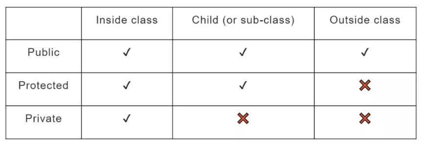

<pre>
OOPs (Object-Oriented Programming System) is a programming paradigm centered around the 
concept of "objects," which can represent real-world entities. These objects encapsulate both 
data (attributes) and methods (functions) that operate on the data. OOPs is based on four 
fundamental principles:

Encapsulation: Bundling the data (attributes) and the methods (functions) that manipulate the 
data into a single unit or class. It provides access control, preventing unauthorized access 
to the internals of the class.

Abstraction: Hiding the complex implementation details from the user and exposing only the 
essential features. It simplifies the interaction with the object.

Inheritance: Allows a new class (child class) to inherit properties and behaviors from an 
existing class (parent class), enabling code reusability and hierarchical relationships.

Polymorphism: The ability of objects to take on many forms. It allows a single function or 
method to behave differently based on the object it is operating on (e.g., function 
overloading, function overriding).

---

@ Why do we need OOPs?
Real-world modeling: OOPs enables us to model real-world problems more effectively by 
representing entities as objects with defined attributes and behaviors.

Code reusability: Through inheritance, we can reuse code across different classes without 
needing to rewrite it, saving time and reducing redundancy.

Maintainability: Encapsulation and abstraction help in managing complexity, making the code 
more modular, easier to understand, and maintain.

Flexibility and Scalability: Polymorphism allows flexibility in the system by enabling code 
to handle different types of objects in a unified way. This makes the system more scalable.

Data security: By restricting access to data through encapsulation, we can protect the 
internal state of objects and only expose what’s necessary.
</pre>

---
### Class in C++

A class defines a type by bundling data and methods (functions) that operate on that data 
into a single unit. It represents the template or structure that outlines the properties 
(data members) and behaviors (member functions) that the objects of that class will have.

```c++
class ClassName {
public:
    // Data members (variables)
    int data;
    // Member functions (methods)
    void display() {
        std::cout << "Data: " << data << std::endl;
    }
};
 
class Car {
private:
    int speed;
public:
    // Constructor to initialize speed
    Car(int s) {
        speed = s;
    }
    // Getter method to access the private member 'speed'
    int getSpeed() {
        return speed;
    }
    // Setter method to modify the private member 'speed'
    void setSpeed(int s) {
        speed = s;
    }
    // Member function to display speed
    void displaySpeed() {
        std::cout << "Speed: " << speed << " km/h" << std::endl;
    }
};
```

#### Empty Class

An empty class in C++ is a class that has no data members or member functions. Even though it 
appears empty, the C++ standard mandates that every class must have a minimum size in memory, 
typically 1 byte, to ensure that each object has a unique address.
 
```c++
#include <iostream>
class EmptyClass {
    // Empty class with no data members or member functions
};
int main() {
    EmptyClass obj;  // Creating an object of the empty class
    std::cout << "Size of empty class object: " << sizeof(obj) << " byte(s)" << std::endl;
    return 0;
}
```

```
Why is an Empty Class Not Truly Empty?
Even though the class does not contain any members, the object created 
from it still occupies memory (usually 1 byte) to ensure that each object 
has a unique memory address. This unique address is necessary for proper 
functioning, especially when working with pointers or referencing the 
object.

Use Cases of Empty Classes:
Placeholders: Sometimes empty classes are used as placeholders in 
templates or in situations where class declarations are required for 
compilation but do not need to hold any data at the moment.

Tagging Classes: They can be used to distinguish between types during 
template specialization or inheritance. For example, an empty class can be 
used as a base class to provide certain traits or properties to derived 
classes.

Marker Interface Pattern: Like in Java or other OOP languages, empty
classes in C++ can be used for tagging objects to indicate they belong to a
particular category without adding data or behavior.
```

---

### Object in C++

An object is an instance of a class. It is created from the class definition and can 
access class members (data and functions). Each object has its own copy of the data 
members defined by the class, but the member functions are shared among all objects.
 
```c++
int main() {
    // Creating an object 'myCar' of class 'Car'
    Car myCar(120);  // Calls the constructor
    // Accessing member function
    myCar.displaySpeed();  // Output: Speed: 120 km/h
    // Modifying the speed using setter
    myCar.setSpeed(150);
    // Display the updated speed
    myCar.displaySpeed();  // Output: Speed: 150 km/h
    return 0;
}

// In this example:
// Class: Car is the blueprint that defines the properties (speed) and behaviors (setSpeed(), displaySpeed()).

// Object: myCar is an instance of the Car class. It can access the class's public member 
// functions like setSpeed() and displaySpeed().
```

---

### Access Modifiers

Access Specifiers:
Public Members: Can be accessed from outside the class.
Private Members: Can only be accessed by member functions of the same class.
Protected Members: Can be accessed within the class and by derived classes.




```c++
class Rectangle {
private:
    int length;
    int width;
public:
    // Constructor to initialize the rectangle
    Rectangle(int l, int w) {
        length = l;
        width = w;
    }
    // Member function to calculate the area
    int calculateArea() {
        return length * width;
    }
    // Member function to display the area
    void displayArea() {
        std::cout << "Area: " << calculateArea() << std::endl;
    }
};
int main() {
    // Creating objects
    Rectangle rect1(10, 5);
    Rectangle rect2(8, 4);
    // Calling member function for rect1
    rect1.displayArea();  // Output: Area: 50
    // Calling member function for rect2
    rect2.displayArea();  // Output: Area: 32
    return 0;
}
```

---

### Getter & Setters

In C++, getter and setter methods are used to access and modify private or protected 
class members. These methods provide controlled access to the internal data of a class, 
ensuring encapsulation by keeping the data hidden from direct access while still 
allowing interaction with it.

Why Use Getters and Setters?
Encapsulation: The idea is to keep class data private and only expose specific 
functionality to modify or retrieve the data.

Validation: You can validate input data in setters to ensure only valid values are 
assigned.

Read-Only or Write-Only Access: A class can allow read-only access by only defining a 
getter or write-only access by only defining a setter.

```c++
class Person {
private:
    int age;  // Private member variable, not accessible outside the class
public:
    // Setter: Used to modify the value of 'age'
    void setAge(int a) {
        if (a > 0) {  // Validation to ensure age is positive
            age = a;
        } else {
            std::cout << "Age must be positive!" << std::endl;
        }
    }
    // Getter: Used to access the value of 'age'
    int getAge() {
        return age;
    }
};
int main() {
    Person person;
    
    // Setting age using setter
    person.setAge(25);  // Valid input
    std::cout << "Person's age: " << person.getAge() << std::endl;  // Output: 25
    
    // Trying to set an invalid age
    person.setAge(-5);  // Will print an error message
    
    return 0;
}

// How Getters and Setters Work:

// Setter (setAge(int a)): This function sets the value of the private member age. It 
// performs validation to ensure that the age is positive.

// Getter (getAge()): This function returns the current value of age.

// Advantages of Using Getters and Setters:
// Control over Data Access: You can control how the data is accessed and modified. For 
// example, you can restrict the range of valid values through validation in the setter.

// Easy Refactoring: If the internal representation of a variable changes, you only need 
// to modify the getter and setter functions, not the entire codebase.

// Read-Only/Write-Only Variables: By using only getters or setters, you can create 
// variables that can only be read or only be written to.

// Best Practices:
// Use getters and setters to maintain encapsulation.
// Use a setter for validation or to trigger actions when a value is set.
// If a member variable should not be modified, only provide a getter to make it read-only.
// Avoid direct access to class members, which breaks the encapsulation principle.
```

---
---

### padding

<pre>
In C++, padding refers to the extra space added by the compiler between data members of 
a class or struct to align data in memory. The main goal of padding is to optimize 
memory access and improve performance, especially on certain hardware architectures 
where accessing misaligned memory can be inefficient or even cause errors.

Why Padding Exists:
Different data types have different alignment requirements. For example:
A char typically has a 1-byte alignment.
An int might require a 4-byte alignment.
A double might require 8-byte alignment.
To ensure that variables are aligned in memory according to their type's requirements, 
the compiler may insert extra bytes (padding) between members of a struct or class.
Example Without Padding:
</pre>
 
```c++
#include <iostream>
struct Example {
    char a;
    int b;
    char c;
};
int main() {
    std::cout << "Size of char: " << sizeof(char) << " byte" << std::endl;
    std::cout << "Size of int: " << sizeof(int) << " bytes" << std::endl;
    std::cout << "Size of Example struct: " << sizeof(Example) << " bytes"<< std::endl;
    return 0;
}
 
// Expected Output:
// arduino
// Copy code
// Size of char: 1 byte
// Size of int: 4 bytes
// Size of Example struct: 12 bytes
```
<pre>
Explanation:
char a: Takes 1 byte.
int b: Needs 4 bytes and should start at an address divisible by 4. Therefore, the 
compiler inserts 3 bytes of padding after char a to align int b correctly.

char c: Takes 1 byte but, after int b, another 3 bytes of padding may be inserted to 
maintain alignment for arrays of the struct.

So, instead of the struct being 6 bytes (1 byte for a, 4 bytes for b, 1 byte for c), it 
becomes 12 bytesdue to the padding.
 
Memory Layout:
Offset   Variable    Size
0        a           1 byte
1-3      Padding     3 bytes
4        b           4 bytes
8        c           1 byte
9-11     Padding     3 bytes
 
Controlling Padding (Packing):
You can control or disable padding using pragma directives or compiler-specific flags 
to pack the structure more tightly. However, this may lead to performance degradation 
on some platforms because of unaligned memory access.

Example with #pragma pack:
</pre>

```c++
#include <iostream>
#pragma pack(1)  // Disable padding
struct PackedExample {
    char a;
    int b;
    char c;
};
int main() {
    std::cout << "Size of PackedExample struct: " << sizeof(PackedExample) << " bytes" << std::endl;
    return 0;
}
// Output
// Size of PackedExample struct: 6 bytes


// In this case, the compiler is told to pack the members without any padding, resulting 
// in a more compact struct size (6 bytes).
// Tips to Reduce Padding:
// Reorder Members: Arrange members in the struct or class so that larger types appear 
// first. This can help reduce padding.


struct OptimizedExample {
    int b;   // 4 bytes
    char a;  // 1 byte
    char c;  // 1 byte
};

// Here, only 2 bytes of padding are added, making the total size 8 bytes instead of 12.
// Use #pragma pack with Caution: Only use packing if you really need to optimize memory 
// usage, and ensure your system supports unaligned access.
```
