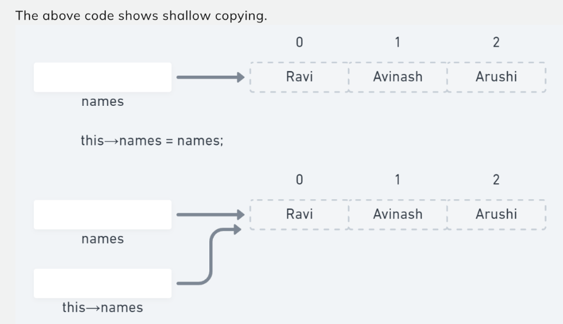
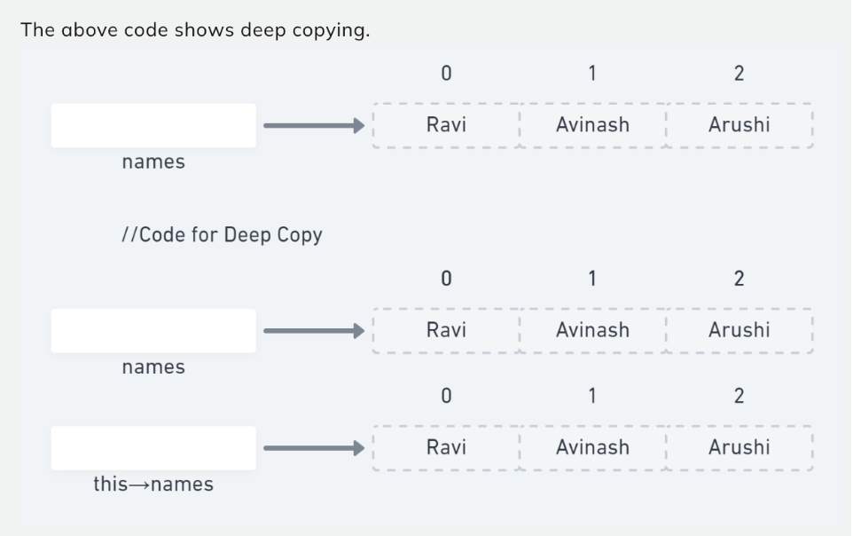
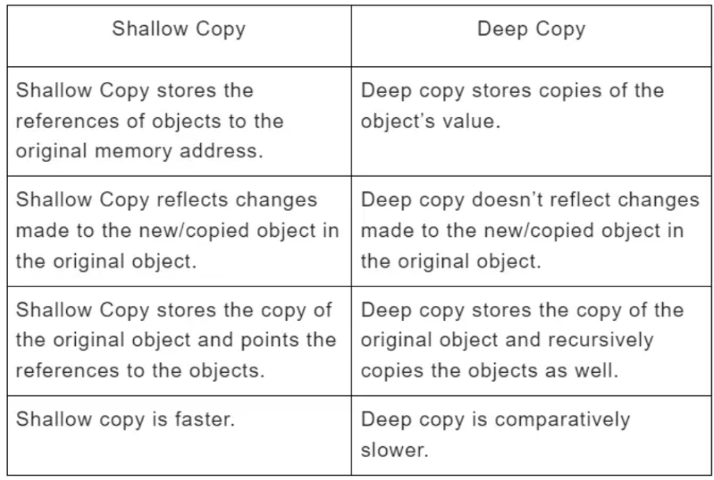

## Shallow Copy

An object is created by simply copying the data of all variables of the original object. 
Here, the pointer will be copied but not the memory it points to. It means that the 
original object and the created copy will now point to the same memory address, which is 
generally not preferred. 
 
Since both objects will reference the exact memory location, then change made by one will 
reflect those change in another object as well. This can lead to unpleasant side effects if 
the elements of values are changed via some other reference.  Since we wanted to create an 
object replica, the Shallow copy will not fulfill this purpose. 
 
Note: C++ compiler implicitly creates a copy constructor and assignment operator to perform 
shallow copy at compile time.
A shallow copy can be made by simply copying the reference.

```c++
Example :
    class students() {
    int age;
    char* names;
public:
    students(int age, char* names) {
        this->age = age;
        // shallow copy
        this->names = names;
        // here we are putting the same array.
        // we are just copying the reference
    }
};

```

<!--  -->


---

## Deep Copy
 
An object is created by copying all the fields, and it also allocates similar memory 
resources with the same value to the object. To perform Deep copy, we need to explicitly 
define the copy constructor and assign dynamic memory as well if required. Also, it is 
necessary to allocate memory to the other constructors’ variables dynamically.
A deep copy means creating a new array and copying over the values.
Changes to the array values referred to will not result in changes to the array data 
referred to.
 
```c++
Example :
    class student() {
    int age;
    char* names;
public:
    student(int age, char* names) {
        this->age = age;
        // deep copy
        this->names = new char[strlen(names) + 1];
        strcopy(this->names, names);
        // Created new array and copied data
    }
};
```



---

### What is the difference between deep copy and shallow copy?




