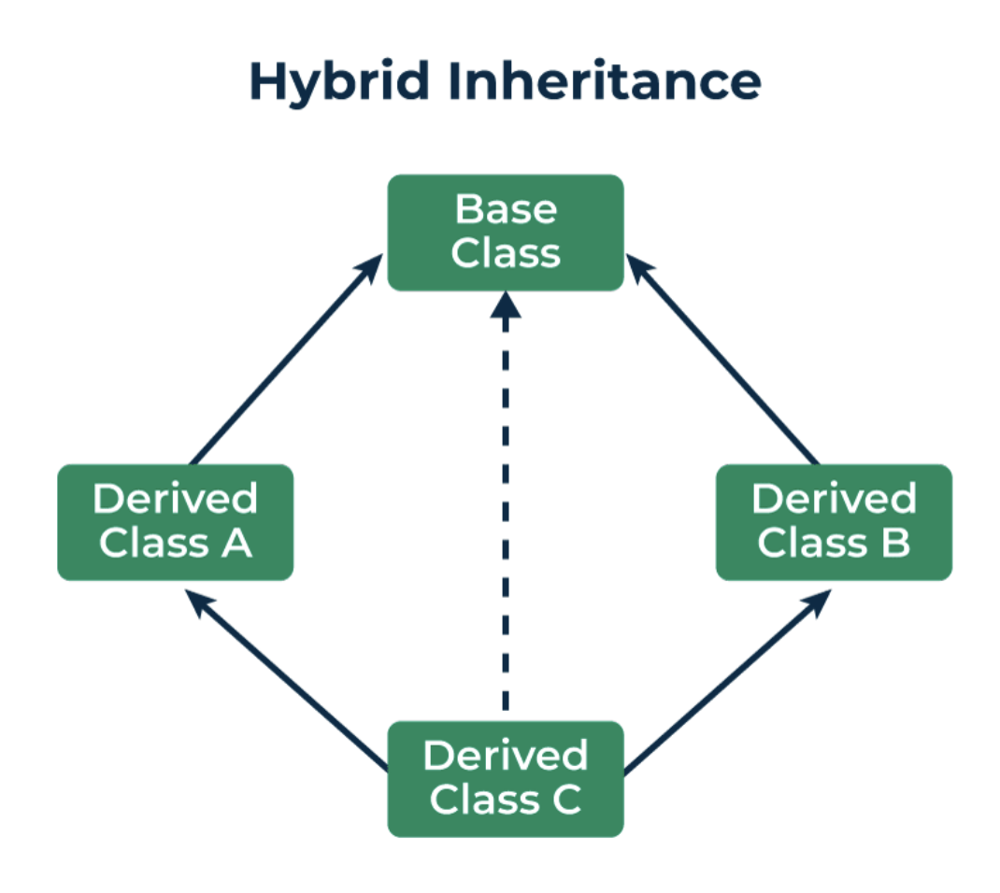
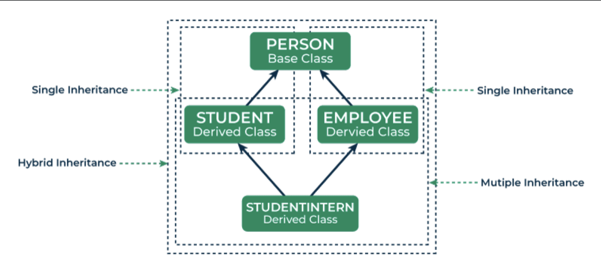

Hybrid inheritance is a complex form of inheritance in object-oriented programming 
(OOP). In Hybrid Inheritance, multiple types of inheritance are combined within a 
single class hierarchy, enabling a varied and flexible structure of classes. In hybrid 
inheritance, within the same class, we can have elements of single inheritance, 
multiple inheritance, multilevel inheritance, and hierarchical inheritance.





The major goal of hybrid inheritance is to enhance code reusability by making it 
simpler for programmers to use the methods and attributes that are already present in 
other classes. Hybrid inheritance has several advantages over other inheritances as it 
increases the reusability of software elements, enables quicker code development lowers 
coding errors by avoiding code duplication across classes, and establishes a more 
clearly defined relationship between classes in object-oriented programming. It also 
provides a structured way to organize classes with shared attributes and behaviors.

However, Hybrid Inheritance also poses some difficulties, like the possibility of 
ambiguity or inconsistencies between inherited attributes and methods. While 
implementing hybrid inheritance, careful design and a thorough understanding of the 
principles of programming languages are essential to ensure that it achieves its goals 
successfully and without introducing any unnecessary complications.

```c++
Examples of Hybrid Inheritance
Example 1: Using Single Inheritance and Multiple Inheritance
Let us consider a scenario where we have a base class “Person”, a derived class “Employee” that uses single inheritance, and another derived class “Student” that also uses single inheritance but combines with “Employee” to create a hybrid inheritance.
 
 
// C++ program to illustrate the hybrid inheritance 
#include <bits/stdc++.h> 
using namespace std;
  
// Base class 
class Person { 
protected: 
    string name; 
  
public:
    Person(const string& name) 
        : name(name) 
    { 
    } 
    void display() { cout << "\nName: " << name << endl; } 
}; 
  
// Derived class 1: Employee (Single Inheritance) 
class Employee : public Person { 
protected: 
    int employeeId; 
  
public:
    Employee(const string& name, int id)
        : Person(name) 
        , employeeId(id) 
    { 
    } 
    void displayEmployee() 
    { 
        display(); 
        cout << "Employee ID: " << employeeId << endl; 
        cout << "Method inside Derived Class Employee"
             << endl; 
    } 
}; 
  
// Derived class 2: Student (Single Inheritance) 
class Student : public Person { 
protected: 
    int studentId; 
  
public:
    Student(const string& name, int id)
        : Person(name) 
        , studentId(id) 
    { 
    } 
    void displayStudent() 
    { 
        display(); 
        cout << "Student ID: " << studentId << endl; 
        cout << "Method inside Derived Class Student"
             << endl; 
    } 
}; 
  
// Derived class 3: StudentIntern (Multiple Inheritance) 
class StudentIntern : public Employee, public Student { 
public:
    StudentIntern(const string& name, int empId, int stuId) 
        : Employee(name, empId) 
        , Student(name, stuId) 
    { 
    } 
    void displayStudentIntern() 
    { 
        cout << "Methods inside Derived Class "
                "StudentIntern : "
             << endl; 
        displayEmployee(); 
        displayStudent(); 
    } 
}; 
  
// driver code 
int main() 
{ 
    StudentIntern SI("Riya", 67537, 2215); 
    SI.displayStudentIntern(); 
  
    return 0; 
}
Output
Methods inside Derived Class StudentIntern : 
Name: Riya
Employee ID: 67537
Method inside Derived Class Employee
Name: Riya
Student ID: 2215
Method inside Derived Class Student
```

It is important to note that the “StudentIntern” class exhibits the diamond problem of 
multiple inheritances as it inherits display() from both “Employee” and “Student” which 
in turn inherits from “Person”.
Explanation

1. An instance of the “StudentIntern” class named “SI” is created in the main function 

2. with arguments:
Name: Riya
Employee ID: 67537
Student ID: 2215

1. The “displayStudentIntern” method of the “SI” object is called.

2. Inside the “displayStudentIntern” method,
Methods inside Derived Class “StudentIntern” is displayed as a header.
The “displayEmployee” method of the “Employee” class is called.
Inside “displayEmployee”, the “display” method of the “Person” class (base class) is 
called to display the name along with the employee ID.
The “displayStudent” method of the “Student” class is called.
Inside “displayStudent”, the display method of the “Person” class (base class) is 
called to display the name again along with the student ID.


