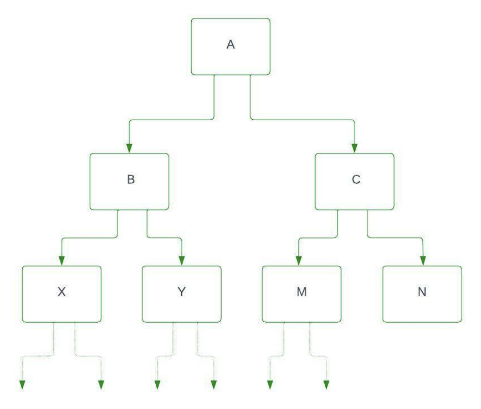

In Hierarchical inheritance, more than one sub-class inherits the property of a 
single base class. There is one base class and multiple derived classes. Several 
other classes inherit the derived classes as well. Hierarchical structures thus 
form a tree-like structure. It is similar to that, mango and apple both are fruits; 
both inherit the property of fruit. Fruit will be the Base class, and mango and 
apple are sub-classes. 
The below diagram shows, Class A is a Base class, B is a subclass inherited from class A, and C is a subclass it also inherits from class A.

Similarly, if another subclass inherits property from B class and so on then there will be a hierarchy, and a tree-like structure is formed, below is the diagram.





Here X and Y are sub-class (child class) that inherits property from class B, and M and 
N are sub-class (child class) that inherits property from class C. B is the parent 
class of X and Y, and C is the parent class of M and N. access_specifier provides the 
visibility mode in the class declaration. By inheriting from the base class, the 
derived class inherits the members of the base class.

```
Syntax:
Class A 
{  
   ............  
};  
Class B: access_specifier A  
{  
   .........  
};  
Class C: access_specifier A 
{  
  ............. 
};
```

---

```c++
// C++ program for Hierarchical Inheritance 
#include<iostream> 
using namespace std;
  
class A   //superclass A 
{ 
  public:
  void show_A() { 
    cout<<"class A"<<endl; 
  } 
}; 
class B : public A   //subclass B 
{ 
  public:
  void show_B() { 
    cout<<"class B"<<endl; 
  } 
}; 
  
class C : public A   //subclass C 
{ 
  public:
  void show_C() { 
    cout<<"class C"<<endl; 
  } 
}; 
  
int main() { 
  B b;  // b is object of class B 
  cout<<"calling from B: "<<endl; 
  b.show_B(); 
  b.show_A(); 
    
  C c;  // c is object of class C 
  cout<<"calling from C: "<<endl; 
  c.show_C(); 
  c.show_A(); 
  return 0; 
} 
   
// Output
// calling from B: 
// class B
// class A
// calling from C: 
// class C
// class A
// Explanation: In the above program A is the superclass also known as a parent class, 
// and B and C are subclasses also known as the child class. class B and class C 
// inherit property from class A.
```

---

```c++
// C++ program to illustrate the above concept 
  
#include <iostream> 
using namespace std;
  
// Base class 
class shape { 
public:
    string name; 
    int sides; 
  
    shape(string name, int sides) // constructor 
    { 
        this->name = name; // this pointer 
        this->sides = sides; 
    } 
}; 
  
// Derived class 
class triangle : public shape // mode is public 
{ 
  
private:
    int base; 
    int height; 
  
public:
    // shape constructor taking arguments 
    // from triangle constructor 
    triangle(string name, int sides, int base, int height) : shape(name, sides) 
  
    { 
        this->base = base; 
        this->height = height; 
    } 
  
    void area() 
    { 
        cout << "area of triangle: "
             << (0.5 * base * height) << endl; 
    } 
    void details() 
    { 
        cout << "shape is: " << name << endl; 
        cout << "no. of sides are: " << sides << endl;
        cout << "base is: " << base << endl; 
        cout << "height is: " << height << endl; 
        area(); // calling area() 
    } 
}; 
  
// Derived class 
class square : public shape { 
private:
    int height; 
  
public:
    // shape constructor taking arguments 
    // from square constructor 
    square(string name, int sides, int height) : shape(name, sides) 
    { 
        this->height = height; 
    } 
  
    void area() 
    { 
        cout << "area of square: " << (height * height) 
             << endl; 
    } 
  
    void details() 
    { 
        cout << "shape is: " << name << endl; 
        cout << "no. of sides are: " << sides << endl;
        cout << "height is: " << height << endl; 
        area(); // calling area() 
    } 
}; 
  
int main() 
{ 
    // Creating objects 
    triangle t("triangle", 3, 2, 3); 
    square s("square", 4, 2); 
  
    t.details(); 
    cout << endl << endl; 
  
    s.details(); 
    return 0; 
}
// Output
// shape is: triangle
// no. of sides are: 3
// base is: 2
// height is: 3
// area of triangle: 3
// shape is: square
// no. of sides are: 4
// height is: 2
// area of square: 4

// Explanation: In the above code, we created three classes: shape, Triangle, and square. 
// In this example, the shape class is a superclass. triangle and square are subclasses 
// that inherit from the shape class. A constructor in every class is used to initialize 
// data members. Then we created triangle and square objects and used details() to produce 
// information for the triangle and square. Here, access modifiers are public.

```