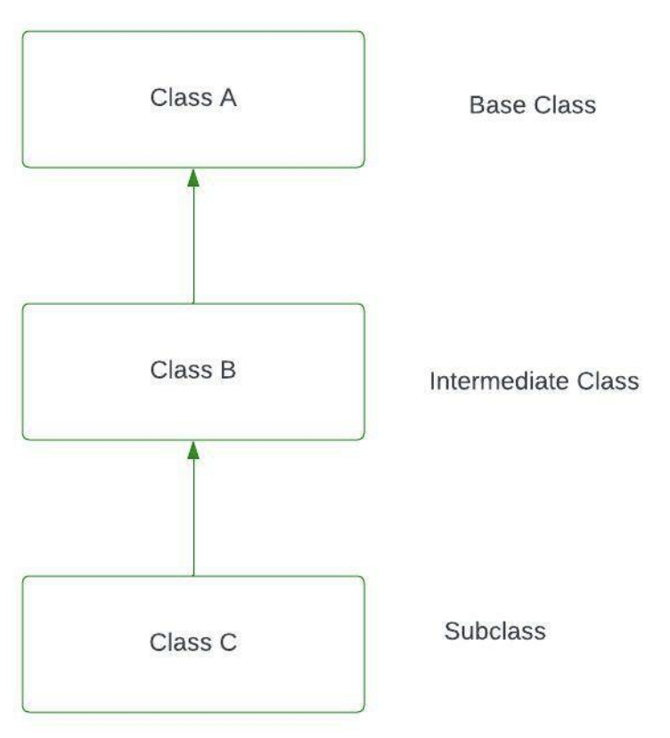

<pre>
Multilevel inheritance is a type of inheritance in C++ where a class is derived from another derived class, forming a chain of inheritance. In other words, a class C inherits from a class B, which itself inherits from a class A. This creates a multi-level hierarchy.
</pre>


```c++
#include<iostream>
using namespace std;
 
class Animal {
    public:
    int age;
    int weight;
 
    public:
    void speak() {
        cout << "Speaking " << endl;
    }
};
class Dog: public Animal {
};
class GermanShepherd: public Dog {
 
};
int main() {
    GermanShepherd g;
    g.speak();
 
    return 0;
}
```



 
```c++
 
#include <iostream>
using namespace std;
// Base class (Grandparent)
class Grandparent {
public:
    void showGrandparent() {
        cout << "Grandparent class" << endl;
    }
};
// Intermediate class (Parent) inheriting from Grandparent
class Parent : public Grandparent {
public:
    void showParent() {
        cout << "Parent class" << endl;
    }
};
// Derived class (Child) inheriting from Parent
class Child : public Parent {
public:
    void showChild() {
        cout << "Child class" << endl;
    }
};
int main() {
    Child obj;
    // Accessing methods from Grandparent, Parent, and Child classes
    obj.showGrandparent(); // Method from Grandparent class
    obj.showParent();      // Method from Parent class
    obj.showChild();       // Method from Child class
    return 0;
}
// Output:
// Grandparent class
// Parent class
// Child class
```

```
Explanation:
Grandparent Class:
This is the base class at the top of the hierarchy. It contains a method showGrandparent().
Parent Class:
Inherits from the Grandparent class using public inheritance. It adds its own method showParent().
Child Class:
Inherits from the Parent class (which in turn inherits from Grandparent). It adds its own method showChild().
```
 

