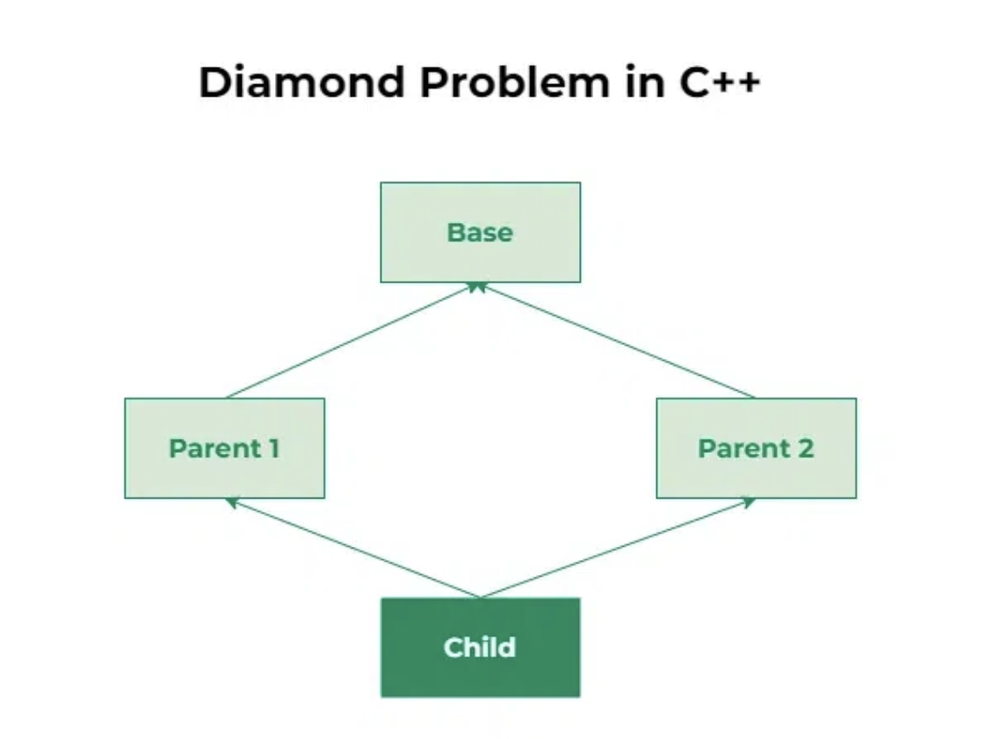

Multiple Inheritance is a feature of C++ where a class can inherit from more than one 
classes.  The constructors of inherited classes are called in the same order in which 
they are inherited. For example, in the following program, B’s constructor is called 
before A’s constructor.

A class can be derived from more than one base class.
Eg: 
(i) A CHILD class is derived from FATHER and MOTHER class
class A
{ 
... .. ... 
};
class B
{
... .. ...
};
class C: public A,public B
{
... ... ...
};

```c++
#include<iostream>
using namespace std;
class Person {
public:
    Person(int x)  { cout << "Person::Person(int ) called" << endl;   }
    Person() 	{ cout << "Person::Person() called" << endl;   }
};
 
class Faculty : virtual public Person {
public:
    Faculty(int x):Person(x)   {
       cout<<"Faculty::Faculty(int ) called"<< endl;
    }
};
 
class Student : virtual public Person {
public:
    Student(int x):Person(x) {
        cout<<"Student::Student(int ) called"<< endl;
    }
};
 
class TA : public Faculty, public Student  {
public:
    TA(int x):Student(x), Faculty(x)   {
        cout<<"TA::TA(int ) called"<< endl;
    }
};
 
int main()  {
    TA ta1(30);
}

// Output:
// Person::Person() called
// Faculty::Faculty(int ) called
// Student::Student(int ) called
// TA::TA(int ) called

// In the above program, constructor of ‘Person’ is called once. One important thing to 
// note in the above output is, the default constructor of ‘Person’ is called. When we use 
// ‘virtual’ keyword, the default constructor of grandparent class is called by default 
// even if the parent classes explicitly call parameterized constructor.
```

```c++
// How to call the parameterized constructor of the ‘Person’ class?
// The constructor has to be called in ‘TA’ class.
// For example, see the following program. 

 
#include<iostream>
using namespace std;
class Person {
public:
    Person(int x)  { cout << "Person::Person(int ) called" << endl;   }
    Person() 	{ cout << "Person::Person() called" << endl;   }
};
 
class Faculty : virtual public Person {
public:
    Faculty(int x):Person(x)   {
       cout<<"Faculty::Faculty(int ) called"<< endl;
    }
};
 
class Student : virtual public Person {
public:
    Student(int x):Person(x) {
        cout<<"Student::Student(int ) called"<< endl;
    }
};
 
class TA : public Faculty, public Student  {
public:
    TA(int x):Student(x), Faculty(x), Person(x)   {
        cout<<"TA::TA(int ) called"<< endl;
    }
};
 
int main()  {
    TA ta1(30);
}

// Output:
// Person::Person(int ) called
// Faculty::Faculty(int ) called
// Student::Student(int ) called
// TA::TA(int ) called
// In general, it is not allowed to call the grandparent’s constructor directly, it has to 
// be called through parent class. It is allowed only when ‘virtual’ keyword is used.
// As an exercise, predict the output of following programs.
```

---

#### Diamond problem

<pre>
The diamond problem The diamond problem occurs when two superclasses of a class have a 
common base class. For example, in the following diagram, the TA class gets two copies 
of all attributes of Person class, this causes ambiguities.
For example, consider the following program

In C++, inheritance is the concept that allows one class to inherit the properties and 
methods of another class. Multiple inheritance is one such type of inheritance that 
allows a class to inherit from more than one base class. While this feature provides 
greater flexibility in modelling real-world relationships, it also introduces 
complexities, one of which is the Diamond Problem.
Diamond Problem

The Diamond Problem is an ambiguity error that arises in multiple inheritance when a 
derived class inherits from two or more base classes that share a common ancestor. This 
results in the inheritance hierarchy forming a diamond shape, hence the name “Diamond 
Problem.” The ambiguity arises because the derived class has multiple paths to access 
members or methods inherited from the common ancestor, leading to confusion during 
method resolution and member access.

</pre>

```c++
#include<iostream>
using namespace std;
class Person {
   // Data members of person 
public:
    Person(int x)  { cout << "Person::Person(int ) called" << endl;   }
};
 
class Faculty : public Person {
   // data members of Faculty
public:
    Faculty(int x):Person(x)   {
       cout<<"Faculty::Faculty(int ) called"<< endl;
    }
};
 
class Student : public Person {
   // data members of Student
public:
    Student(int x):Person(x) {
        cout<<"Student::Student(int ) called"<< endl;
    }
};
 
class TA : public Faculty, public Student  {
public:
    TA(int x):Student(x), Faculty(x)   {
        cout<<"TA::TA(int ) called"<< endl;
    }
};
 
int main()  {
    TA ta1(30);
}
// Person::Person(int ) called
// Faculty::Faculty(int ) called
// Person::Person(int ) called
// Student::Student(int ) called
// TA::TA(int ) called

// In the above program, constructor of ‘Person’ is called two times. Destructor of 
// ‘Person’ will also be called two times when object ‘ta1’ is destructed. So object ‘ta1’ 
// has two copies of all members of ‘Person’, this causes ambiguities. The solution to 
// this problem is ‘virtual’ keyword. We make the classes ‘Faculty’ and ‘Student’ as 
// virtual base classes to avoid two copies of ‘Person’ in ‘TA’ class.
```



```c++
// C++ Program to illustrate the diamond problem
#include <iostream>
using namespace std;
// Base class
class Base {
public:
    void fun() { cout << "Base" << endl; }
};
// Parent class 1
class Parent1 : public Base {
public:
};
// Parent class 2
class Parent2 : public Base {
public:
};
// Child class inheriting from both Parent1 and Parent2
class Child : public Parent1, public Parent2 {
};
int main()
{
    Child* obj = new Child();
    obj->fun(); // Abiguity arises, as Child now has two copies of fun()
    return 0;
}
 
// Output
// main.cpp:30:9: error: request for member ‘fun’ is ambiguous
//    30 |     obj.fun(); // Ambiguity error
//       |         ^~~
// main.cpp:8:10: note: candidates are: ‘void Base::fun()’
//     8 |     void fun() { cout << "Base" << endl; }
//       |          ^~~
// main.cpp:20:10: note:                 ‘void Base::fun()’
```

- Solution to the Diamond Problem in C++
C++ addresses the Diamond Problem using virtual inheritance. Virtual inheritance 
ensures that there is only one instance of the common base class, eliminating the 
ambiguity.

```c++
// C++ Program to illustrate the use of virtual inheritance
// to resolve the diamond problem in multiple inheritance
#include <iostream>
using namespace std;
// Base class
class Base {
public:
    void fun() { cout << "Base" << endl; }
};
// Parent class 1 with virtual inheritance
class Parent1 : virtual public Base {
public:
};
// Parent class 2 with virtual inheritance
class Parent2 : virtual public Base {
public:
};
// Child class inheriting from both Parent1 and Parent2
class Child : public Parent1, public Parent2 {
};
int main()
{
    Child* obj = new Child();
    obj->fun(); // No ambiguity due to virtual inheritance
    return 0;
}

// Output
// Another approach is to rename conflicting methods in the derived classes to avoid 
// ambiguity. By providing distinct names for methods inherited from different base 
// classes, developers can eliminate ambiguity without resorting to virtual inheritance. 
// However, this approach may lead to less intuitive code and increased maintenance 
// overhead.
```