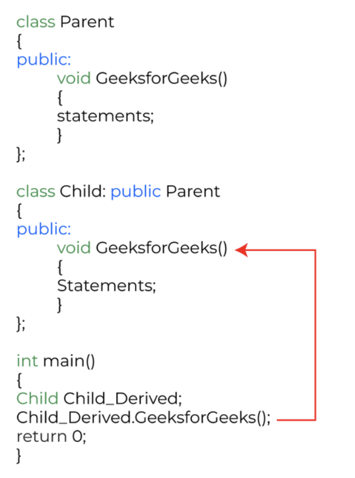

<pre>
Polymorphism is considered one of the important features of Object-Oriented Programming. 
Polymorphism is a concept that allows you to perform a single action in different ways. 
Polymorphism is the combination of two Greek words. The poly means many, and morphs means 
forms. So polymorphism means many forms. Let’s understand polymorphism with a real-life 
example.
 
Real-life example:  A person at the same time can have different characteristics. Like a 
man at the same time is a father, a husband, and an employee. So the same person 
possesses different behavior in different situations. This is called polymorphism.
</pre>

#### Polymorphism

- Compile time Polymorphism --> Function Overloading + Operator Overloading
- Run time Polymorphism --> Virtual Function


### @Compile Time Polymorphism: 

Compile-time polymorphism is also known as static polymorphism. This type of polymorphism can be achieved through function overloading or operator overloading.
 
a) Function overloading:  
When there are multiple functions in a class with the same name but different parameters, 
these functions are overloaded. The main advantage of function overloading is that it 
increases the program’s readability. Functions can be overloaded by using different 
numbers of arguments or by using different types of arguments. We have already discussed 
function overloading in detail in the previous module. 

```c++
#include <iostream>
using namespace std;
 
class Calculator {
public:
    // Function to add two integers
    int add(int a, int b) {
        return a + b;
    }
    // Function to add three integers
    int add(int a, int b, int c) {
        return a + b + c;
    }
};
int main() {
    Calculator calc;
    // Calling overloaded functions
    int sum1 = calc.add(10, 20);        // Calls the version that adds two integers
    int sum2 = calc.add(10, 20, 30);    // Calls the version that adds three integers
    cout << "Sum of 10 and 20: " << sum1 << endl;
    cout << "Sum of 10, 20, and 30: " << sum2 << endl;
    return 0;
}
```


b) Operator Overloading: 
C++ also provides options to overload operators. For example, we can make the operator 
(‘+’) for the string class to concatenate two strings. We know that this is the addition 
operator whose task is to add two operands. When placed between integer operands, a 
single operator, ‘+,’ adds them and concatenates them when placed between string operands.
 
Points to remember while overloading an operator:
It can be used only for user-defined operators(objects, structures) but cannot be used 
for in-built operators(int, char, float, etc.).
Operators = and & are already overloaded in C++ to avoid overloading them.
The precedence and associativity of operators remain intact.


List of operators that can be overloaded in C++:\\

```c++
// Example: Perform the addition of two imaginary or complex numbers.
 
#include<iostream>
using namespace std;
class Complex {
private:
    int real, imag;
public:
    Complex(int r = 0, int i = 0) {
        real = r;
        imag = i;
    }
    // This is automatically called when '+' is used with
    // between two Complex objects
    Complex operator + (Complex const & b) {
        Complex a;
        a.real = real + b.real;
        a.imag = imag + b.imag;
        return a;
    }
    void print() {
        cout << real << " + i" << imag << endl;
    }
};
int main() {
    Complex c1(10, 5), c2(2, 4);
    Complex c3 = c1 + c2; 
    // An example call to "operator+"
    c3.print();
}
// Output:
// 12 + i9
```

---

### @Runtime polymorphism:

This type of polymorphism is achieved by Function Overriding. Late binding and dynamic 
polymorphism are other names for runtime polymorphism. The function call is resolved at 
runtime in runtime polymorphism. In contrast, with compile time polymorphism, the 
compiler determines which function call to bind to the object after deducing it at 
runtime.
 
#### A. Function Overriding
Function Overriding occurs when a derived class has a definition for one of the member 
functions of the base class. That base function is said to be overridden.




##### Runtime Polymorphism with Data Members
Runtime Polymorphism cannot be achieved by data members in C++. Let’s see an example 
where we are accessing the field by reference variable of parent class which refers to 
the instance of the derived class.

```c++
// C++ program for function overriding with data members
#include <bits/stdc++.h>
using namespace std;
//  base class declaration.
class Animal {
public:
    string color = "Black";
};
// inheriting Animal class.
class Dog : public Animal {
public:
    string color = "Grey";
};
// Driver code
int main(void)
{
    Animal d = Dog(); // accessing the field by reference
                      // variable which refers to derived
    cout << d.color;
}
// Output
// We can see that the parent class reference will always refer to the data member of the parent class.
```

#### B. Virtual Function

A virtual function is a member function that is declared in the base class using the 
keyword virtual and is re-defined (Overridden) in the derived class.
 
Some Key Points About Virtual Functions:
Virtual functions are Dynamic in nature. 
They are defined by inserting the keyword “virtual” inside a base class and are always 
declared with a base class and overridden in a child class
A virtual function is called during Runtime

```c++
#include <iostream>
using namespace std;
// Declaring a Base class
class GFG_Base {
public:
    // virtual function
    virtual void display()
    {
        cout << "Called virtual Base Class function"
             << "\n\n";
    }
    void print()
    {
        cout << "Called GFG_Base print function"
             << "\n\n";
    }
};
// Declaring a Child Class
class GFG_Child : public GFG_Base {
public:
    void display()
    {
        cout << "Called GFG_Child Display Function"
             << "\n\n";
    }
    void print()
    {
        cout << "Called GFG_Child print Function"
             << "\n\n";
    }
};
int main()
{
    // Create a reference of class GFG_Base
    GFG_Base* base;
    GFG_Child child;
    base = &child;
    // This will call the virtual function
    base->display();
    // This will call the non-virtual function
    base->print();
}
// Output
// Called GFG_Child Display Function
 
// Called GFG_Base print function
```

```c++
#include <bits/stdc++.h>
using namespace std;
class base {
public:
    virtual void print()
    {
        cout << "print base class" << endl;
    }
    void show() { cout << "show base class" << endl; }
};
class derived : public base {
public:
    // print () is already virtual function in
    // derived class, we could also declared as
    // virtual void print () explicitly
    void print() { cout << "print derived class" << endl; }
    void show() { cout << "show derived class" << endl; }
};
// Driver code
int main()
{
    base* bptr;
    derived d;
    bptr = &d;
    // Virtual function, binded at
    // runtime (Runtime polymorphism)
    bptr->print();
    // Non-virtual function, binded
    // at compile time
    bptr->show();
    return 0;
}
// Output
// print derived class
// show base class
```

```
Note: In C++ what calling a virtual functions means is that; if we call a 
member function then it could cause a different function to be executed 
instead depending on what type of object invoked it.

Because overriding from derived classes hasn’t happened yet, the virtual call 
mechanism is disallowed in constructors. Also to mention that objects are 
built from the ground up or follows a bottom to top approach.
What is the use? 
```

#### Virtual functions 

it allows us to create a list of base class pointers and call 
methods of any of the derived classes without even knowing the kind of derived 
class object. 

Real-Life Example to Understand the Implementation of Virtual Function
Consider employee management software for an organization.
Let the code has a simple base class Employee, the class contains virtual 
functions like raiseSalary(), transfer(), promote(), etc. Different types of 
employees like Managers, Engineers, etc., may have their own implementations 
of the virtual functions present in base class Employee. 
In our complete software, we just need to pass a list of employees everywhere 
and call appropriate functions without even knowing the type of employee. For 
example, we can easily raise the salary of all employees by iterating through 
the list of employees. Every type of employee may have its own logic in its 
class, but we don’t need to worry about them because if raiseSalary() is 
present for a specific employee type, only that function would be called.

```c++
// C++ program to demonstrate how a virtual function
// is used in a real life scenario
 
class Employee {
public:
    virtual void raiseSalary()
    {
        // common raise salary code
    }
 
    virtual void promote()
    {
        // common promote code
    }
};
 
class Manager : public Employee {
    virtual void raiseSalary()
    {
        // Manager specific raise salary code, may contain
        // increment of manager specific incentives
    }
 
    virtual void promote()
    {
        // Manager specific promote
    }
};
 
// Similarly, there may be other types of employees
 
// We need a very simple function
// to increment the salary of all employees
// Note that emp[] is an array of pointers
// and actual pointed objects can
// be any type of employees.
// This function should ideally
// be in a class like Organization,
// we have made it global to keep things simple
void globalRaiseSalary(Employee* emp[], int n)
{
    for (int i = 0; i < n; i++) {
        // Polymorphic Call: Calls raiseSalary()
        // according to the actual object, not
        // according to the type of pointer
        emp[i]->raiseSalary();
    }
}
```

Like the ‘globalRaiseSalary()‘ function, there can be many other operations that can be 
performed on a list of employees without even knowing the type of the object instance. 
 
 
Consider the following simple program as an example of runtime polymorphism. The main thing 
to note about the program is that the derived class’s function is called using a base class 
pointer.
The idea is that virtual functions are called according to the type of the object instance 
pointed to or referenced, not according to the type of the pointer or reference.
In other words, virtual functions are resolved late, at runtime.

```c++
// C++ program to demonstrate how we will calculate
// area of shapes without virtual function
#include <iostream>
using namespace std;
 
// Base class
class Shape {
public:
    // parameterized constructor
    Shape(int l, int w)
    {
        length = l;
        width = w;
    }
    int get_Area()
    {
        cout << "This is call to parent class area\n";
        // Returning 1 in user-defined function means true
        return 1;
    }
 
protected:
    int length, width;
};
 
// Derived class
class Square : public Shape {
public:
    Square(int l = 0, int w = 0)
        : Shape(l, w)
    {
    } // declaring and initializing derived class
    // constructor
    int get_Area()
    {
        cout << "Square area: " << length * width << '\n';
        return (length * width);
    }
};
// Derived class
class Rectangle : public Shape {
public:
    Rectangle(int l = 0, int w = 0)
        : Shape(l, w)
    {
    } // declaring and initializing derived class
    // constructor
    int get_Area()
    {
        cout << "Rectangle area: " << length * width
             << '\n';
        return (length * width);
    }
};
 
int main()
{
    Shape* s;
 
    // Making object of child class Square
    Square sq(5, 5);
 
    // Making object of child class Rectangle
    Rectangle rec(4, 5);
    s = &sq; // reference variable
    s->get_Area();
    s = &rec; // reference variable
    s->get_Area();
 
    return 0; // too tell the program executed
    // successfully
}
// Output
// This is call to parent class area
// This is call to parent class area


// In the above example:
// We store the address of each child’s class Rectangle and Square object in s and
// Then we call the get_Area() function on it,
// Ideally, it should have called the respective get_Area() functions of the child classes but
// Instead, it calls the get_Area() defined in the base class.
// This happens due to static linkage which means the call to get_Area() is getting set only once by the compiler which is in the base class.
```


```c++
// Example: C++ Program to Calculate the Area of Shapes using Virtual Function
// C++
// C++ program to demonstrate how we will calculate
// the area of shapes USING VIRTUAL FUNCTION
#include <fstream>
#include <iostream>
using namespace std;
 
// Declaration of Base class
class Shape {
public:
    // Usage of virtual constructor
    virtual void calculate()
    {
        cout << "Area of your Shape ";
    }
    // usage of virtual Destuctor to avoid memory leak
    virtual ~Shape()
    {
        cout << "Shape Destuctor Call\n";
    }
};
 
// Declaration of Derived class
class Rectangle : public Shape {
public:
    int width, height, area;
 
    void calculate()
    {
        cout << "Enter Width of Rectangle: ";
        cin >> width;
 
        cout << "Enter Height of Rectangle: ";
        cin >> height;
 
        area = height * width;
        cout << "Area of Rectangle: " << area << "\n";
    }
 
    // Virtual Destuctor for every Derived class
    virtual ~Rectangle()
    {
        cout << "Rectangle Destuctor Call\n";
    }
};
 
// Declaration of 2nd derived class
class Square : public Shape {
public:
    int side, area;
 
    void calculate()
    {
        cout << "Enter one side your of Square: ";
        cin >> side;
 
        area = side * side;
        cout << "Area of Square: " << area << "\n";
    }
   
   // Virtual Destuctor for every Derived class
    virtual ~Square()
    {
        cout << "Square Destuctor Call\n";
    }
};
 
int main()
{
 
    // base class pointer
    Shape* S;
    Rectangle r;
 
    // initialization of reference variable
    S = &r;
 
    // calling of Rectangle function
    S->calculate();
    Square sq;
 
    // initialization of reference variable
    S = &sq;
 
    // calling of Square function
    S->calculate();
 
    // return 0 to tell the program executed
    // successfully
    return 0;
}
// Output:
// Enter Width of Rectangle: 10
// Enter Height of Rectangle: 20
// Area of Rectangle: 200
// Enter one side your of Square: 16
// Area of Square: 256
```